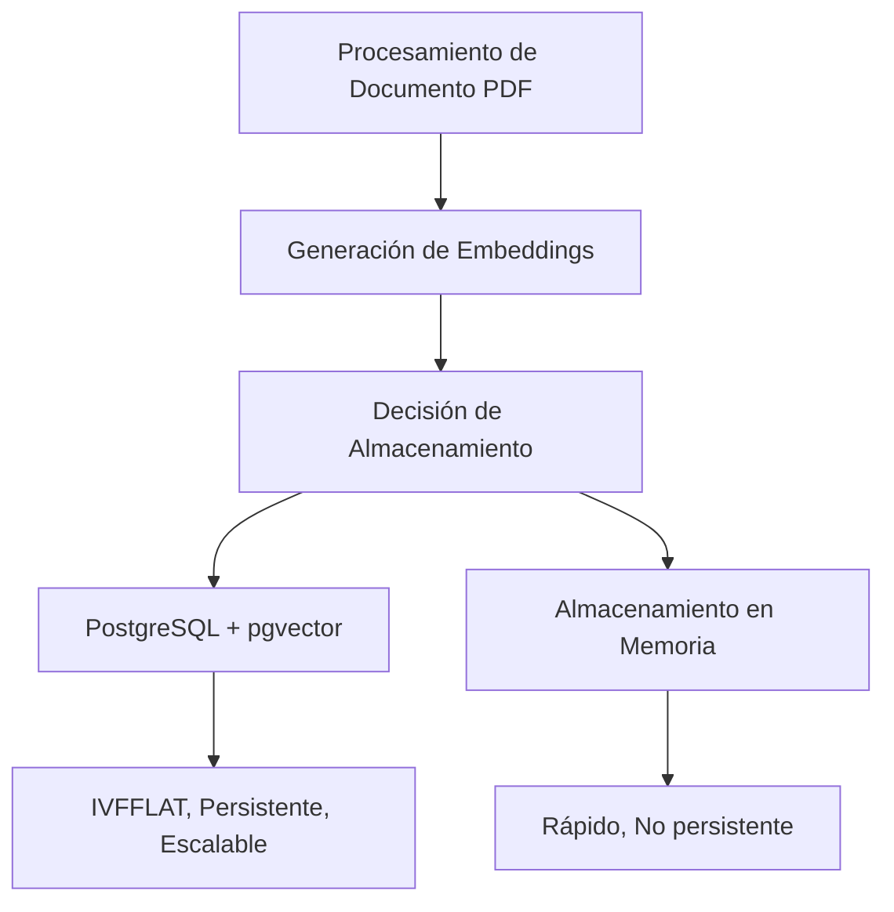

# JS Embeddings - Sistema RAG

Un proyecto TypeScript para construir un sistema de Generación Aumentada por Recuperación (RAG) que procesa archivos PDF, crea embeddings, los almacena persistentemente en PostgreSQL con pgvector, y responde preguntas usando un modelo de lenguaje impulsado por Llama.cpp.

## Características

- **Procesamiento de PDF**: Extrae contenido de texto de archivos PDF usando PDFLoader de LangChain
- **Creación de Embeddings**: Genera embeddings a partir del texto del documento usando modelos de embedding (por ejemplo, BGE-small)
- **Almacenamiento Vectorial Persistente**: Almacena embeddings en PostgreSQL con la extensión pgvector para búsqueda de similitud escalable
- **Fallback Elegante**: Si PostgreSQL no está disponible, los embeddings se mueven automáticamente al almacenamiento en memoria
- **Búsqueda de Similitud**: Encuentra fragmentos de documentos relevantes basados en similitud vectorial usando distancia coseno
- **RAG (Recuperación Aumentada por Generación)**: Responde preguntas usando un modelo de lenguaje con contexto recuperado
- **Soporte Flexible de Modelos**: Usa diferentes modelos de Llama.cpp para embeddings y generación
- **Alto Rendimiento**: Indexación vectorial IVFFLAT para búsquedas de vecinos más cercanos rápidas

## Arquitectura



## Prerrequisitos

- Node.js 18+ y npm
- **PostgreSQL 13+** con extensión pgvector
- Dos modelos compatibles con Llama.cpp:
  1. **Modelo de Embedding** (requerido): `models/bge-small-en-v1.5-Q8_0.gguf`
  2. **Modelo de Lenguaje** (opcional): `models/neural-chat-7b-v3-3-Q4_K_M.gguf` o similar

## Instalación

### 1. Instalar PostgreSQL & pgvector

**macOS:**
```bash
brew install postgresql@15
brew install pgvector
brew services start postgresql@15
```

**Linux (Ubuntu/Debian):**
```bash
sudo apt-get install postgresql postgresql-contrib
sudo apt-get install build-essential postgresql-server-dev-15
git clone https://github.com/pgvector/pgvector.git
cd pgvector && make && sudo make install
sudo systemctl start postgresql
```

Ver [PGVECTOR_SETUP.md](./PGVECTOR_SETUP.md) para configuración detallada de PostgreSQL.

### 2. Crear Base de Datos

```bash
psql -U postgres
```

```sql
CREATE DATABASE embeddings;
\c embeddings
CREATE EXTENSION vector;
```

### 3. Instalar Dependencias de Node

```bash
npm install
```

Esto crea `node_modules/` con todos los paquetes requeridos incluyendo el cliente `pg` para PostgreSQL.

### 4. Configurar Entorno (Opcional)

Crea un archivo `.env` en la raíz del proyecto:

```bash
PG_HOST=localhost
PG_PORT=5432
PG_USER=postgres
PG_PASSWORD=postgres
PG_DATABASE=embeddings
```

### 5. Descargar Modelos Requeridos

**Modelo de Embedding** (Ve a [Hugging Face](https://huggingface.co/) y descarga):
```bash
# Modelo de embedding BGE-small
# Coloca en: models/bge-small-en-v1.5-Q8_0.gguf
```

## Uso

### Búsqueda RAG Básica

Ejecuta la aplicación con un archivo PDF y una consulta:
```bash
npm start /ruta/a/tu/archivo.pdf "Tu pregunta aquí"
```

### Usando Opciones de Línea de Comando

También puedes usar opciones de línea de comando para mayor flexibilidad:

```bash
# Con --pdf y --query
npm start -- --pdf /ruta/a/tu/archivo.pdf --query "Tu pregunta aquí"

# Solo --pdf (sin consulta, solo procesa el PDF)
npm start -- --pdf /ruta/a/tu/archivo.pdf

# Solo --query (busca embeddings existentes)
npm start -- --query "Tu pregunta aquí"

# Sin opciones (usando argumentos posicionales)
npm start documentos/paper.pdf "¿Cuáles son los principales hallazgos?"
```

### Consultar Embeddings Existentes

También puedes consultar embeddings existentes sin proporcionar un archivo PDF:
```bash
npm start
```
Esto buscará a través de los embeddings existentes en PostgreSQL/pgvector y devolverá fragmentos relevantes.

### Ejemplos

```bash
# Responde una pregunta sobre un PDF
npm start documentos/paper.pdf "¿Cuáles son los principales hallazgos?"

# Consulta por defecto si no se proporciona
npm start documentos/guide.pdf

# Con ruta relativa
npm start ./mi-documento.pdf "Resume la introducción"

# Consultar embeddings existentes (sin PDF)
npm start

# Usando opciones de línea de comando
npm start -- --pdf documentos/paper.pdf --query "¿Cuáles son los principales hallazgos?"

# Solo --pdf
npm start -- --pdf documentos/paper.pdf

# Solo --query
npm start -- --query "¿Cuál es el tema principal?"
```

### Modo de Desarrollo

Modo de vigilancia con recarga automática:
```bash
npm run dev
```

### Compilación

## Flujo de Trabajo y Arquitectura

### Fase 1: Creación y Almacenamiento de Embeddings
1. Procesa PDF y extrae contenido de texto
2. Divide el texto en fragmentos manejables (~1000 caracteres)
3. Genera embeddings para cada fragmento usando el modelo de embedding
4. **Almacena embeddings persistentemente en PostgreSQL con pgvector**
   - Si PostgreSQL no está disponible, fallback automático al almacenamiento en memoria
   - Usa indexación IVFFLAT para búsquedas de similitud rápidas
   - Embeddings almacenados con metadatos en la tabla `embeddings`

### Fase 2: Procesamiento de Consultas
1. Genera un embedding para la pregunta del usuario
2. Busca fragmentos similares en PostgreSQL pgvector usando similitud vectorial (distancia coseno)
3. Recupera los fragmentos más relevantes (top-K) como contexto

### Fase 3: Generación de Respuesta
1. Envía la pregunta del usuario + contexto relevante al modelo de lenguaje
2. El modelo genera una respuesta basada en el contexto proporcionado
3. Retorna la respuesta formateada al usuario

## Arquitectura de Almacenamiento

```
┌─────────────────────────────────────────┐
│    Documentos PDF → Embeddings           │
└────────────────┬────────────────────────┘
                 │
         ┌───────▼──────────┐
         │  Intentar PostgreSQL  │
         │   con pgvector  │
         └───────┬──────────┘
              ✓  │  ✗
       ┌────────┘└─────────┐
       │                   │
    ┌──▼──────┐       ┌────▼────┐
    │PostgreSQL│      │Almacenamiento│
    │pgvector  │      │en Memoria │
    └──────────┘      └──────────┘
```

## Arquitectura

```
┌─────────────────────────────────┐
│   Procesamiento de Documento PDF│
│   (pdf-embeddings.ts)           │
└────────────┬────────────────────┘
             │
             ▼
┌─────────────────────────────────┐
│   Generación de Embeddings      │
│   (node-llama-cpp)              │
└────────────┬────────────────────┘
             │
             ▼
┌─────────────────────────────────┐
│   Decisión de Almacenamiento    │
│   (embedding-store.ts)          │
└────┬─────────────────────┬──────┘
     │                     │
  (Intentar)             (Fallback)
     │                     │
     ▼                     ▼
┌──────────────┐    ┌─────────────┐
│ PostgreSQL   │    │  Almacenamiento│
│ + pgvector   │    │   en Memoria  │
│              │    │             │
│ • IVFFLAT    │    │ • Rápido      │
│ • Persistente│    │ • No persistente│
│ • Escalable  │    │             │
└──────────────┘    └─────────────┘
```

## Estructura del Proyecto

```
js-embeddings/
├── src/
│   ├── main.ts                 # Punto de entrada, manejo CLI
│   ├── pdf-embeddings.ts       # Funciones de procesamiento PDF y embeddings
│   ├── query-engine.ts         # Motor de pregunta y respuesta RAG
│   ├── embedding-store.ts      # Gestión de almacenamiento PostgreSQL pgvector + Memoria
│   └── embedding-search.ts     # Utilidades de búsqueda y recuperación
├── models/
│   ├── bge-small-en-v1.5-Q8_0.gguf         # Modelo de embedding
│   └── neural-chat-7b-v3-3-Q4_K_M.gguf    # Modelo de lenguaje (opcional)
├── package.json
├── tsconfig.json
├── PGVECTOR_SETUP.md           # Guía de configuración de PostgreSQL/pgvector
└── README.md
```

## Referencia de API

### Almacenamiento de Embeddings (`embedding-store.ts`)

**`createEmbeddingStore(): Promise<EmbeddingStore>`**
- Crea el almacenamiento de embeddings (PostgreSQL con pgvector si está disponible, fallback a memoria)
- Verifica automáticamente la conectividad con PostgreSQL
- Configurable mediante variables de entorno (PG_HOST, PG_PORT, PG_USER, PG_PASSWORD, PG_DATABASE)

**`storeEmbeddingsWithFallback(store, chunks, embeddings)`**
- Almacena embeddings en PostgreSQL o memoria con fallback automático

**`PgVectorStore.queryByEmbedding(embedding, limit)`** (Avanzado)
- Consulta PostgreSQL directamente usando similitud vectorial
- Retorna resultados con puntuaciones de similitud coseno
- Maneja errores de forma elegante retornando un array vacío para fallback

### Búsqueda de Embeddings (`embedding-search.ts`)

**`searchEmbeddings(store, query, limit): Promise<string[]>`**
- Busca embeddings almacenados para documentos similares
- Retorna los top-N resultados

**`getStorageInfo(store): Object`**
- Retorna información sobre el tipo y ubicación del almacenamiento

**`clearAllEmbeddings(store)`**
- Elimina todos los embeddings almacenados

### PDF y Embeddings (`pdf-embeddings.ts`)

**`parsePDF(pdfPath: string): Promise<string[]>`**
- Procesa un archivo PDF y divide el contenido en fragmentos
- Retorna array de fragmentos de texto

**`embedDocuments(context: LlamaEmbeddingContext, documents: readonly string[]): Promise<Map<string, LlamaEmbedding>>`**
- Crea embeddings para fragmentos de documentos
- Maneja errores de forma elegante

**`findSimilarDocuments(embedding: LlamaEmbedding, documentEmbeddings: Map): string[]`**
- Encuentra fragmentos similares a un embedding de consulta
- Retorna ordenados por puntuación de similitud

### Motor de Consulta (`query-engine.ts`)

**`createQueryEngine(llama: Llama, modelPath: string): Promise<LlamaContext | null>`**
- Carga un modelo de lenguaje para procesamiento de consultas
- Retorna null si la carga del modelo falla

**`queryWithContext(context: LlamaContext, query: string, documents: string[], maxResults: number): Promise<QueryResult>`**
- Genera respuestas usando contexto recuperado
- Fallback a coincidencia de palabras clave si la generación falla

**`formatQueryResult(result: QueryResult): string`**
- Formatea el resultado de RAG para mostrar

## Dependencias

- **node-llama-cpp**: Enlaces Llama.cpp para Node.js
- **@langchain/community**: Cargadores de documentos
- **typescript**: Lenguaje
- **ts-node**: Tiempo de ejecución TypeScript

## Configuración

### Tamaño de Fragmento
Modifica en `src/pdf-embeddings.ts`:
```typescript
const MAX_CONTEXT_CHARS = 1000; // Ajusta según los límites del modelo
```

### Selección de Modelo
Cambia modelos en `src/main.ts`:
```typescript
const embeddingModelPath = "ruta/al/modelo/embedding.gguf";
const llmModelPath = "ruta/al/modelo/llm.gguf";
```

## Resolución de Problemas

### Error "Modelo no encontrado"
- Asegúrate de que los archivos de modelo estén en el directorio `models/`
- Verifica las rutas de archivo en `main.ts`

### Error "Contexto demasiado largo"
- Reduce `MAX_CONTEXT_CHARS` en `pdf-embeddings.ts`
- Usa un modelo más pequeño o uno con ventana de contexto más grande

### Modelo de lenguaje no procesando
- El sistema mostrará solo los fragmentos relevantes como fallback
- Descarga un modelo de lenguaje para funcionalidad completa de RAG
- Asegúrate de que el modelo esté en formato GGUF

### Consulta falla sin resultados
- Si consultas embeddings existentes y no obtienes resultados, verifica que los embeddings existan en la base de datos
- El sistema caerá automáticamente al almacenamiento en memoria si PostgreSQL no está disponible

## Consejos de Rendimiento

1. **Usa Aceleración por GPU**: Metal en macOS, CUDA en NVIDIA, Rocm en AMD o Vulkan para compatibilidad multi-vendedor, comprueba la compatibilidad con node-llama-cpp
2. **Ajusta el Tamaño del Contexto**: Fragmentos más grandes = mejor contexto pero procesamiento más lento
3. **Limita los Resultados Recuperados**: Usa menos fragmentos como contexto para generación más rápida
4. **Selección de Modelo**: Modelos más pequeños (7B) para velocidad, más grandes (13B+) para calidad

## Ejemplo de Salida

```
📄 Procesando PDF desde: /ruta/al/documento.pdf
✓ PDF procesado en 45 fragmentos
✓ Embeddings creados exitosamente (45 fragmentos embebidos)

❓ Consulta: "¿Cuál es el tema principal?"
✓ Encontrados 3 fragmentos relevantes

📚 Fragmentos de documentos más relevantes:
────────────────────────────────────────────────
[Fragmento 1]
El tema principal de este documento es...
[Fragmento 2]
Basándose en esto, podemos ver...
────────────────────────────────────────────────

╔════════════════════════════════════════════════════════════════╗
║                    RESULTADO DE CONSULTA                     ║
╚════════════════════════════════════════════════════════════════╝

📝 Pregunta: "¿Cuál es el tema principal?"
💡 Respuesta:
El tema principal es... [generado por el modelo de lenguaje]
```

## Licencia

ISC